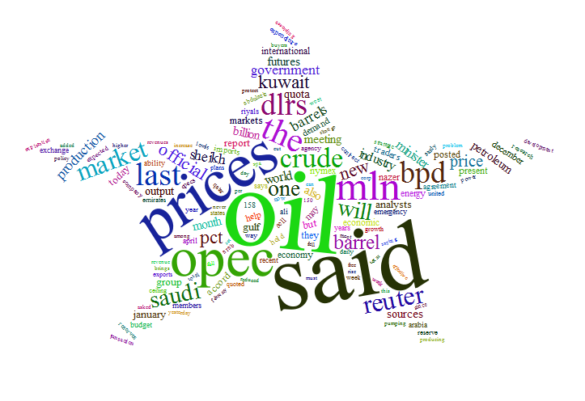
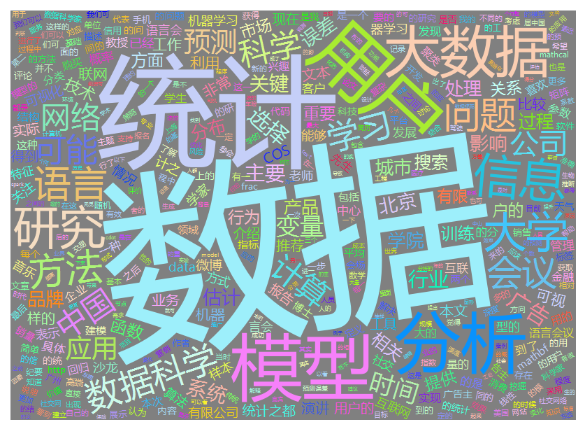
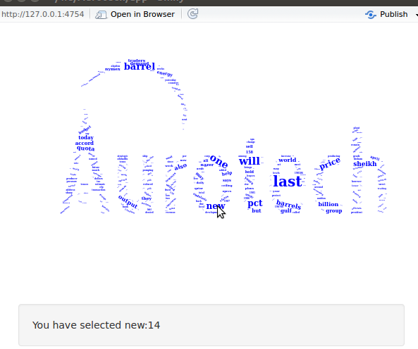

## wordcloud2

[](https://cran.r-project.org/package=wordcloud2)

[](https://ci.appveyor.com/project/lchiffon/wordcloud2)

R interface to wordcloud for data visualization.
Timdream's [wordcloud2.js](https://github.com/timdream/wordcloud2.js) is used in this package.

## contributors


- [JacobXPX](https://github.com/JacobXPX)
- [AdamSpannbauer](https://github.com/JacobXPX)
- [ekstroem](https://github.com/ekstroem)
- [timelyportfolio](https://github.com/timelyportfolio)
- [AdeelK93](https://github.com/AdeelK93)


### Original description

#### Installation

```
devtools::install_github("lchiffon/wordcloud2")
```
knitr and shiny is support in wordcloud2 package.

#### Example

```
library(wordcloud2)
wordcloud2(demoFreq, size = 1,shape = 'star')
```




```
wordcloud2(demoFreq, size = 2, minRotation = -pi/2, maxRotation = -pi/2)
```


```
wordcloud2(demoFreq, size = 2, minRotation = -pi/6, maxRotation = -pi/6,
  rotateRatio = 1)
```


#### Chinese version
```
## Sys.setlocale("LC_CTYPE","eng")
wordcloud2(demoFreqC, size = 2, fontFamily = "微软雅黑",
           color = "random-light", backgroundColor = "grey")
```



#### Example of successfully deploying interactivate clickable wordcloud with special shape on R-shiny

Thanks [JacobXPX](https://github.com/JacobXPX)'s contribution to this feature:

```
devtools::install_github("JacobXPX/wordcloud2")
# Same as:
# devtools::install_github("lchiffon/wordcloud2")
library(shiny)
library(wordcloud2)
library(tm)

shinyApp(
  ui = shinyUI(fluidPage(
    mainPanel(
      wordcloud2Output("wordcloud", clickedWordInputId = "selected_word")
    ),
    
    sidebarPanel(
      textOutput("selected_var")
    )
  )),
  server = shinyServer(function(input, output) {
    figPath = system.file("examples/t.png",package = "wordcloud2")
    wordcloud_plot <- wordcloud2(data = demoFreq, figPath = figPath, size = 0.6,color = "blue")
    output$wordcloud  <- renderWordcloud2(wordcloud_plot)
    output$selected_var <- renderText({ 
      paste("You have selected", input$selected_word)
    })
  })
)
```

run the above code and click refresh, it will work.


