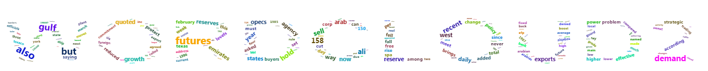
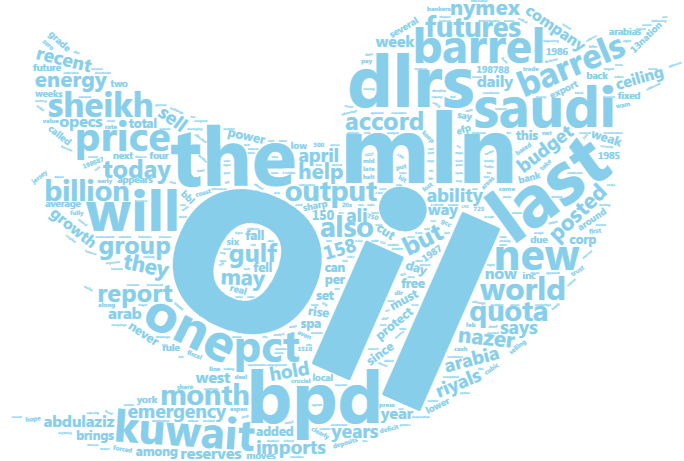
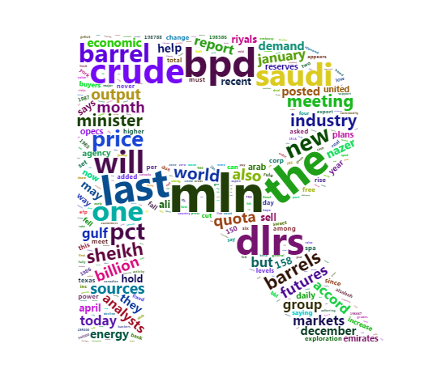

This is an introduction to `wordcloud2` package. This package provides an HTML5 interface to wordcloud for data visualization. [Timdream's wordcloud2.js](https://github.com/timdream/wordcloud2.js) is used in this package.


This document show two main function in `Wordcloud2`:

1. `wordcloud2`: provide traditional wordcloud with HTML5
2. `letterCloud`: provide wordcloud with selected word(letters).

### install wordcloud2

You may have installed this package. Well, I still want to leave these codes here for installing.

```r
require(devtools)
install_github("lchiffon/wordcloud2")
```

### `wordlcoud2` function

You can use wordcloud directly:

```r
library(wordcloud2)
wordcloud2(data = demoFreq)
```

<!--html_preserve--><div id="htmlwidget-8949" style="width:672px;height:480px;" class="wordcloud2 html-widget"></div>
<script type="application/json" data-for="htmlwidget-8949">{"x":{"word":["oil","said","prices","opec","mln","the","last","bpd","dlrs","crude","market","reuter","saudi","will","one","barrel","kuwait","new","official","pct","price","barrels","government","production","sheikh","industry","meeting","minister","world","also","billion","futures","month","output","petroleum","quota","sources","accord","analysts","but","group","gulf","january","markets","report","today","december","demand","economic","economy","energy","help","international","may","nazer","nymex","posted","present","they","traders","158","ability","agreement","ali","april","arabia","budget","emergency","exchange","hold","imports","members","recent","riyals","says","sell","years","abdulaziz","agency","arab","ceiling","company","contract","daily","emirates","expected","expenditure","exports","growth","now","opecs","plans","qatar","quoted","research","reserve","reserves","states","study","united","way","week","west","year","150","according","added","among","asked","brings","buyers","can","change","corp","cut","day","development","effective","exploration","fall","february","fell","free","higher","increase","levels","meet","must","never","per","policy","power","problem","producing","protect","pumping","reduced","revenue","revenues","rise","saying","set","since","spa","strategic","texas","this","total","transaction","weak","yesterday","13nation","1985","198586","1986","1987","198788","address","agreed","alkhalifa","alqabas","alsabah","announced","appears","arabian","arabias","around","average","back","bank","bbl","boost","called","commitment","companies","compared","countrys","current","decrease","denied","dollars","domestic","due","efp","estimate","estimates","export","fixed","foreign","four","future","grade","guard","high","hisham","however","inc","indonesia","indonesias","intermediate","kingdoms","kuwaits","local","low","lower","lowered","made","main","march","mckiernan","measures","mizrahi","moves","much","named","next","officials","plant","position","president","pressure","producer","projected","published","real","refinery","reiterated","remain","rule","say","sector","several","sharp","ship","six","slightly","smaller","spokeswoman","state","sweet","texaco","three","trading","two","weeks","york","1518","198687","20s","285000","500","725","750","948000","activity","adhering","agriculture","along","apparently","appeared","approved","architect","areas","aspen","bankers","based","benchmark","benefits","canada","canadian","cash","changed","changes","circumstance","clearly","closed","coast","come","committee","commodity","consumption","countries","country","crossroads","crucial","cubic","currently","customers","deal","decembers","decline","deficit","deposits","deputy","diamond","differentials","difficulties","direction","discounted","dlr","early","ecuador","effect","embargo","embassy","entering","even","falling","feb","first","fiscal","fiscales","forced","fully","gcc","general","given","grades","halt","hit","hope","humanistic","impact","import","increased","increasing","instead","institute","interview","investment","jersey","june","keep","late","light","limit","limits","line","lost","louisiana","lowest","major","marketing","member","mid","million","ministers","mitigate","months","nearing","net","neutral","none","nuclear","organisation","organization","outlook","overseas","pact","pay","petroliferos","planned","port","positive","postings","predicted","press","pricing","private","probably","problems","pronounced","protected","public","put","quotes","raise","rate","reduction","referring","remarks","reports","return","review","risks","riyal","selfimposed","selling","share","shortfall","spot","steady","stick","strongly","studies","support","take","taken","techniques","throughput","trade","trust","trying","uncertainty","union","value","wam","wanted","weakness","winter","yacimientos","yanbu","zero","zone","100000","108","111","115","12217","1232","1381","13member","156","1600","1635","1650","1667","168","1685","1752","180000","200000","200foot","2226","24hour","2766","300","3749598","3750003","4133","534","5472","614","658","6745","678","718","738","able","abroad","accept","across","add","addressed","adherence","advantage","advisers","after","agricultural","aground","allocated","allocations","allow","almost","already","althani","although","alvite","amidst","analysis","analyst","annual","anything","apparent","aramco","argentine","arrangement","asia","asian","assesses","assign","assigned","associates","attract","available","averaging","aware","bahrain","bahrains","balance","baseless","basic","basis","because","beginning","bijan","bin","bit","bodys","briefly","broadened","brothers","buildings","burden","buy","buyer","calendar","cambridge","capacity","capozza","carrying","center","century","cera","certain","cftc","chairman","challenge","characterized","charging","cheap","cheating","chevron","chv","cited","citing","clever","close","closer","closes","coming","commission","communications","companys","completed","complex","condition","conditions","considered","construction","contacts","continuation","continue","continued","continues","contracted","contributed","control","cooperation","coordination","copany","corps","council","counter","coupled","covered","creek","critical","cts","currency","custom","cuts","cutting","cypriot","daniel","david","days","debtburdened","debut","decided","declared","declines","deemed","defence","delaware","delivered","delivering","departments","deregulate","deregulation","determination","devalue","device","differential","difficulty","dillard","director","discuss","discussing","distribution","distributions","divided","doha","dollar","drawbacks","drop","dropped","earlier","earnings","eastern","easy","ecuadors","editor","edmontonswann","education","eight","either","elaborate","elections","electricity","end","engineers","entitlements","environment","equally","estimated","european","exceed","exceeding","excess","excesses","excessive","exerted","exist","expanded","expansion","expartners","expectations","expects","explained","exporting","exxon","face","faced","faces","facilities","facing","failed","fallen","favours","fee","fernando","figure","figures","finance","firmer","floating","followed","for","forces","foremost","fourth","frank","full","fundamentals","gas","generally","geneva","get","globalization","glut","guaranteed","halting","harvard","heads","health","hedge","hedged","helped","hemisphere","highly","hills","hitting","hoped","housing","houston","immediately","implementation","improve","improvement","include","including","independent","indications","initiate","initiative","institutions","interbank","interest","investments","issue","jamaica","jan","juaymah","jubail","jump","just","khalifa","lack","largest","later","latest","launched","lead","leading","learn","least","lending","less","lesson","level","liberalised","lift","liftings","like","lines","liquidity","little","loan","lodged","longterm","ltd","lukman","lull","maintain","make","manager","manipulate","many","marathon","marathons","marker","mcfadden","means","mercantile","metrers","metres","mid1960s","mid1986","mideast","minus","mlotok","mob","mobil","momentum","money","monopolies","monthend","moussavarrahmani","movement","nation","natural","need","needs","negative","negotiate","neither","network","news","newspaper","nigerian","nine","nonoil","northern","notes","offset","onetwelfth","oneweek","open","opens","operations","opposite","optimism","optimistic","option","order","organiaation","our","outlining","outside","overproducing","part","parties","partly","party","past","paths","paul","paulsboro","payments","pegged","performance","period","pertains","pessimistic","philadelphia","physical","placed","plastics","platinum","point","policies","political","population","positions","postponed","pressures","previous","primarily","primary","principal","procedure","produce","produced","producers","product","products","program","projection","projects","prompted","proposed","proved","providing","provision","publish","purposes","quarter","quiet","quietly","quotas","rallied","ran","ranging","ras","rates","rationalise","readdress","reaffirmed","reasonable","recommending","recovering","recurrent","reference","refineries","refining","reflect","refloat","reform","reforms","regain","regard","regarding","region","regional","reiterate","relaxation","relieve","reluctant","remainder","remained","reported","request","resistance","resisting","resources","respectively","responsibilites","restored","restraint","restrictions","result","reuters","revealed","reviews","right","rilwanu","rising","river","rocks","rosemary","rumour","rushing","sales","salomon","santos","satisfied","saw","scheduled","scheme","seapride","season","secretary","security","seeing","seek","september","series","serve","services","session","sets","seven","severely","shamrock","sharply","shoulder","show","showed","shown","signed","signs","situation","sixmonth","slackens","slide","slump","social","sold","soon","sort","sour","south","southeast","spend","spill","spoke","spokesman","spotnext","spriggs","stabilise","stabilize","stable","start","statement","steel","steering","steps","stiff","storage","strong","subsequently","substitution","succeed","suffer","suffering","suhartos","sunday","sundays","supply","supporting","suppose","surrounding","swift","talks","tanker","tanurah","tapers","teach","telephone","terminals","test","there","third","thomas","though","thought","threemonth","tide","together","told","totalled","tower","trader","trades","traditional","traditionally","transacted","transmission","transport","trends","trusts","try","turmoil","twofold","uae","uncertain","unchanged","under","unions","unitholders","universitys","unlikely","unocal","unusually","urged","use","virtual","wants","water","wealth","wednesday","weekend","welcomed","when","whether","wishes","worldwide","xon","yergin","yesterdays"],"freq":[85,73,48,42,31,26,24,23,23,21,20,20,18,18,17,15,14,14,14,14,13,11,11,11,11,10,10,10,10,9,9,9,9,9,9,9,9,8,8,8,8,8,8,8,8,8,7,7,7,7,7,7,7,7,7,7,7,7,7,7,6,6,6,6,6,6,6,6,6,6,6,6,6,6,6,6,6,5,5,5,5,5,5,5,5,5,5,5,5,5,5,5,5,5,5,5,5,5,5,5,5,5,5,5,4,4,4,4,4,4,4,4,4,4,4,4,4,4,4,4,4,4,4,4,4,4,4,4,4,4,4,4,4,4,4,4,4,4,4,4,4,4,4,4,4,4,4,4,4,4,4,3,3,3,3,3,3,3,3,3,3,3,3,3,3,3,3,3,3,3,3,3,3,3,3,3,3,3,3,3,3,3,3,3,3,3,3,3,3,3,3,3,3,3,3,3,3,3,3,3,3,3,3,3,3,3,3,3,3,3,3,3,3,3,3,3,3,3,3,3,3,3,3,3,3,3,3,3,3,3,3,3,3,3,3,3,3,3,3,3,3,3,3,3,3,3,2,2,2,2,2,2,2,2,2,2,2,2,2,2,2,2,2,2,2,2,2,2,2,2,2,2,2,2,2,2,2,2,2,2,2,2,2,2,2,2,2,2,2,2,2,2,2,2,2,2,2,2,2,2,2,2,2,2,2,2,2,2,2,2,2,2,2,2,2,2,2,2,2,2,2,2,2,2,2,2,2,2,2,2,2,2,2,2,2,2,2,2,2,2,2,2,2,2,2,2,2,2,2,2,2,2,2,2,2,2,2,2,2,2,2,2,2,2,2,2,2,2,2,2,2,2,2,2,2,2,2,2,2,2,2,2,2,2,2,2,2,2,2,2,2,2,2,2,2,2,2,2,2,2,2,2,2,2,2,2,2,2,2,2,2,2,2,2,1,1,1,1,1,1,1,1,1,1,1,1,1,1,1,1,1,1,1,1,1,1,1,1,1,1,1,1,1,1,1,1,1,1,1,1,1,1,1,1,1,1,1,1,1,1,1,1,1,1,1,1,1,1,1,1,1,1,1,1,1,1,1,1,1,1,1,1,1,1,1,1,1,1,1,1,1,1,1,1,1,1,1,1,1,1,1,1,1,1,1,1,1,1,1,1,1,1,1,1,1,1,1,1,1,1,1,1,1,1,1,1,1,1,1,1,1,1,1,1,1,1,1,1,1,1,1,1,1,1,1,1,1,1,1,1,1,1,1,1,1,1,1,1,1,1,1,1,1,1,1,1,1,1,1,1,1,1,1,1,1,1,1,1,1,1,1,1,1,1,1,1,1,1,1,1,1,1,1,1,1,1,1,1,1,1,1,1,1,1,1,1,1,1,1,1,1,1,1,1,1,1,1,1,1,1,1,1,1,1,1,1,1,1,1,1,1,1,1,1,1,1,1,1,1,1,1,1,1,1,1,1,1,1,1,1,1,1,1,1,1,1,1,1,1,1,1,1,1,1,1,1,1,1,1,1,1,1,1,1,1,1,1,1,1,1,1,1,1,1,1,1,1,1,1,1,1,1,1,1,1,1,1,1,1,1,1,1,1,1,1,1,1,1,1,1,1,1,1,1,1,1,1,1,1,1,1,1,1,1,1,1,1,1,1,1,1,1,1,1,1,1,1,1,1,1,1,1,1,1,1,1,1,1,1,1,1,1,1,1,1,1,1,1,1,1,1,1,1,1,1,1,1,1,1,1,1,1,1,1,1,1,1,1,1,1,1,1,1,1,1,1,1,1,1,1,1,1,1,1,1,1,1,1,1,1,1,1,1,1,1,1,1,1,1,1,1,1,1,1,1,1,1,1,1,1,1,1,1,1,1,1,1,1,1,1,1,1,1,1,1,1,1,1,1,1,1,1,1,1,1,1,1,1,1,1,1,1,1,1,1,1,1,1,1,1,1,1,1,1,1,1,1,1,1,1,1,1,1,1,1,1,1,1,1,1,1,1,1,1,1,1,1,1,1,1,1,1,1,1,1,1,1,1,1,1,1,1,1,1,1,1,1,1,1,1,1,1,1,1,1,1,1,1,1,1,1,1,1,1,1,1,1,1,1,1,1,1,1,1,1,1,1,1,1,1,1,1,1,1,1,1,1,1,1,1,1,1,1,1,1,1,1,1,1,1,1,1,1,1,1,1,1,1,1,1,1,1,1,1,1,1,1,1,1,1,1,1,1,1,1,1,1,1,1,1,1,1,1,1,1,1,1,1,1,1,1,1,1,1,1,1,1,1,1,1,1],"fontFamily":"Segoe UI","fontWeight":"bold","color":"random-dark","minSize":0,"weightFactor":2.11764705882353,"backgroundColor":"white","gridSize":0,"minRotation":-0.785398163397448,"maxRotation":0.785398163397448,"shuffle":true,"rotateRatio":0.4,"shape":"circle","ellipticity":0.65,"figBase64":null},"evals":[],"jsHooks":[]}</script><!--/html_preserve-->

`demoFreq` is a data.frame including word and freq in each column.


```r
head(demoFreq)
```

```
##          word freq
## oil       oil   85
## said     said   73
## prices prices   48
## opec     opec   42
## mln       mln   31
## the       the   26
```

### Parameters
- `data`
  - A data frame including word and freq in each column
- `size`
  - Font size, default is 1. The larger size means the bigger word.
- `fontFamily`	
  - Font to use.
- `fontWeight`	
  - Font weight to use, e.g. normal, bold or 600
- `color`	
  - color of the text, keyword 'random-dark' and 'random-light' can be used. color vector is also supported in this param
- `minSize`	
 - A character string of the subtitle
- `backgroundColor`	
  - Color of the background.
- `gridSize`	
  - Size of the grid in pixels for marking the availability of the canvas the larger the grid size, the bigger the gap between words.
- `minRotation`	
  - If the word should rotate, the minimum rotation (in rad) the text should rotate.
- `maxRotation`	
  - If the word should rotate, the maximum rotation (in rad) the text should rotate. Set the two value equal to keep all text in one angle.
- `rotateRatio`	
  - Probability for the word to rotate. Set the number to 1 to always rotate.
- `shape`	
  - The shape of the "cloud" to draw. Can be a keyword present. Available presents are 'circle' (default), 'cardioid' (apple or heart shape curve, the most known polar equation), 'diamond' (alias of square), 'triangle-forward', 'triangle', 'pentagon', and 'star'.
- `ellipticity`
  - degree of "flatness" of the shape wordcloud2.js should draw.
- `figPath`
  - A fig used for the wordcloud.
- `widgetsize`	
  - size of the widgets

#### Example1: use color and backgroundcolor

```r
wordcloud2(demoFreq, color = "random-light", backgroundColor = "grey")
```


#### Example2: use rotations


```r
wordcloud2(demoFreq, minRotation = -pi/6, maxRotation = -pi/6, minSize = 10,
  rotateRatio = 1)
```

<!--html_preserve--><div id="htmlwidget-7789" style="width:672px;height:480px;" class="wordcloud2 html-widget"></div>
<script type="application/json" data-for="htmlwidget-7789">{"x":{"word":["oil","said","prices","opec","mln","the","last","bpd","dlrs","crude","market","reuter","saudi","will","one","barrel","kuwait","new","official","pct","price","barrels","government","production","sheikh","industry","meeting","minister","world","also","billion","futures","month","output","petroleum","quota","sources","accord","analysts","but","group","gulf","january","markets","report","today","december","demand","economic","economy","energy","help","international","may","nazer","nymex","posted","present","they","traders","158","ability","agreement","ali","april","arabia","budget","emergency","exchange","hold","imports","members","recent","riyals","says","sell","years","abdulaziz","agency","arab","ceiling","company","contract","daily","emirates","expected","expenditure","exports","growth","now","opecs","plans","qatar","quoted","research","reserve","reserves","states","study","united","way","week","west","year","150","according","added","among","asked","brings","buyers","can","change","corp","cut","day","development","effective","exploration","fall","february","fell","free","higher","increase","levels","meet","must","never","per","policy","power","problem","producing","protect","pumping","reduced","revenue","revenues","rise","saying","set","since","spa","strategic","texas","this","total","transaction","weak","yesterday","13nation","1985","198586","1986","1987","198788","address","agreed","alkhalifa","alqabas","alsabah","announced","appears","arabian","arabias","around","average","back","bank","bbl","boost","called","commitment","companies","compared","countrys","current","decrease","denied","dollars","domestic","due","efp","estimate","estimates","export","fixed","foreign","four","future","grade","guard","high","hisham","however","inc","indonesia","indonesias","intermediate","kingdoms","kuwaits","local","low","lower","lowered","made","main","march","mckiernan","measures","mizrahi","moves","much","named","next","officials","plant","position","president","pressure","producer","projected","published","real","refinery","reiterated","remain","rule","say","sector","several","sharp","ship","six","slightly","smaller","spokeswoman","state","sweet","texaco","three","trading","two","weeks","york","1518","198687","20s","285000","500","725","750","948000","activity","adhering","agriculture","along","apparently","appeared","approved","architect","areas","aspen","bankers","based","benchmark","benefits","canada","canadian","cash","changed","changes","circumstance","clearly","closed","coast","come","committee","commodity","consumption","countries","country","crossroads","crucial","cubic","currently","customers","deal","decembers","decline","deficit","deposits","deputy","diamond","differentials","difficulties","direction","discounted","dlr","early","ecuador","effect","embargo","embassy","entering","even","falling","feb","first","fiscal","fiscales","forced","fully","gcc","general","given","grades","halt","hit","hope","humanistic","impact","import","increased","increasing","instead","institute","interview","investment","jersey","june","keep","late","light","limit","limits","line","lost","louisiana","lowest","major","marketing","member","mid","million","ministers","mitigate","months","nearing","net","neutral","none","nuclear","organisation","organization","outlook","overseas","pact","pay","petroliferos","planned","port","positive","postings","predicted","press","pricing","private","probably","problems","pronounced","protected","public","put","quotes","raise","rate","reduction","referring","remarks","reports","return","review","risks","riyal","selfimposed","selling","share","shortfall","spot","steady","stick","strongly","studies","support","take","taken","techniques","throughput","trade","trust","trying","uncertainty","union","value","wam","wanted","weakness","winter","yacimientos","yanbu","zero","zone","100000","108","111","115","12217","1232","1381","13member","156","1600","1635","1650","1667","168","1685","1752","180000","200000","200foot","2226","24hour","2766","300","3749598","3750003","4133","534","5472","614","658","6745","678","718","738","able","abroad","accept","across","add","addressed","adherence","advantage","advisers","after","agricultural","aground","allocated","allocations","allow","almost","already","althani","although","alvite","amidst","analysis","analyst","annual","anything","apparent","aramco","argentine","arrangement","asia","asian","assesses","assign","assigned","associates","attract","available","averaging","aware","bahrain","bahrains","balance","baseless","basic","basis","because","beginning","bijan","bin","bit","bodys","briefly","broadened","brothers","buildings","burden","buy","buyer","calendar","cambridge","capacity","capozza","carrying","center","century","cera","certain","cftc","chairman","challenge","characterized","charging","cheap","cheating","chevron","chv","cited","citing","clever","close","closer","closes","coming","commission","communications","companys","completed","complex","condition","conditions","considered","construction","contacts","continuation","continue","continued","continues","contracted","contributed","control","cooperation","coordination","copany","corps","council","counter","coupled","covered","creek","critical","cts","currency","custom","cuts","cutting","cypriot","daniel","david","days","debtburdened","debut","decided","declared","declines","deemed","defence","delaware","delivered","delivering","departments","deregulate","deregulation","determination","devalue","device","differential","difficulty","dillard","director","discuss","discussing","distribution","distributions","divided","doha","dollar","drawbacks","drop","dropped","earlier","earnings","eastern","easy","ecuadors","editor","edmontonswann","education","eight","either","elaborate","elections","electricity","end","engineers","entitlements","environment","equally","estimated","european","exceed","exceeding","excess","excesses","excessive","exerted","exist","expanded","expansion","expartners","expectations","expects","explained","exporting","exxon","face","faced","faces","facilities","facing","failed","fallen","favours","fee","fernando","figure","figures","finance","firmer","floating","followed","for","forces","foremost","fourth","frank","full","fundamentals","gas","generally","geneva","get","globalization","glut","guaranteed","halting","harvard","heads","health","hedge","hedged","helped","hemisphere","highly","hills","hitting","hoped","housing","houston","immediately","implementation","improve","improvement","include","including","independent","indications","initiate","initiative","institutions","interbank","interest","investments","issue","jamaica","jan","juaymah","jubail","jump","just","khalifa","lack","largest","later","latest","launched","lead","leading","learn","least","lending","less","lesson","level","liberalised","lift","liftings","like","lines","liquidity","little","loan","lodged","longterm","ltd","lukman","lull","maintain","make","manager","manipulate","many","marathon","marathons","marker","mcfadden","means","mercantile","metrers","metres","mid1960s","mid1986","mideast","minus","mlotok","mob","mobil","momentum","money","monopolies","monthend","moussavarrahmani","movement","nation","natural","need","needs","negative","negotiate","neither","network","news","newspaper","nigerian","nine","nonoil","northern","notes","offset","onetwelfth","oneweek","open","opens","operations","opposite","optimism","optimistic","option","order","organiaation","our","outlining","outside","overproducing","part","parties","partly","party","past","paths","paul","paulsboro","payments","pegged","performance","period","pertains","pessimistic","philadelphia","physical","placed","plastics","platinum","point","policies","political","population","positions","postponed","pressures","previous","primarily","primary","principal","procedure","produce","produced","producers","product","products","program","projection","projects","prompted","proposed","proved","providing","provision","publish","purposes","quarter","quiet","quietly","quotas","rallied","ran","ranging","ras","rates","rationalise","readdress","reaffirmed","reasonable","recommending","recovering","recurrent","reference","refineries","refining","reflect","refloat","reform","reforms","regain","regard","regarding","region","regional","reiterate","relaxation","relieve","reluctant","remainder","remained","reported","request","resistance","resisting","resources","respectively","responsibilites","restored","restraint","restrictions","result","reuters","revealed","reviews","right","rilwanu","rising","river","rocks","rosemary","rumour","rushing","sales","salomon","santos","satisfied","saw","scheduled","scheme","seapride","season","secretary","security","seeing","seek","september","series","serve","services","session","sets","seven","severely","shamrock","sharply","shoulder","show","showed","shown","signed","signs","situation","sixmonth","slackens","slide","slump","social","sold","soon","sort","sour","south","southeast","spend","spill","spoke","spokesman","spotnext","spriggs","stabilise","stabilize","stable","start","statement","steel","steering","steps","stiff","storage","strong","subsequently","substitution","succeed","suffer","suffering","suhartos","sunday","sundays","supply","supporting","suppose","surrounding","swift","talks","tanker","tanurah","tapers","teach","telephone","terminals","test","there","third","thomas","though","thought","threemonth","tide","together","told","totalled","tower","trader","trades","traditional","traditionally","transacted","transmission","transport","trends","trusts","try","turmoil","twofold","uae","uncertain","unchanged","under","unions","unitholders","universitys","unlikely","unocal","unusually","urged","use","virtual","wants","water","wealth","wednesday","weekend","welcomed","when","whether","wishes","worldwide","xon","yergin","yesterdays"],"freq":[85,73,48,42,31,26,24,23,23,21,20,20,18,18,17,15,14,14,14,14,13,11,11,11,11,10,10,10,10,9,9,9,9,9,9,9,9,8,8,8,8,8,8,8,8,8,7,7,7,7,7,7,7,7,7,7,7,7,7,7,6,6,6,6,6,6,6,6,6,6,6,6,6,6,6,6,6,5,5,5,5,5,5,5,5,5,5,5,5,5,5,5,5,5,5,5,5,5,5,5,5,5,5,5,4,4,4,4,4,4,4,4,4,4,4,4,4,4,4,4,4,4,4,4,4,4,4,4,4,4,4,4,4,4,4,4,4,4,4,4,4,4,4,4,4,4,4,4,4,4,4,3,3,3,3,3,3,3,3,3,3,3,3,3,3,3,3,3,3,3,3,3,3,3,3,3,3,3,3,3,3,3,3,3,3,3,3,3,3,3,3,3,3,3,3,3,3,3,3,3,3,3,3,3,3,3,3,3,3,3,3,3,3,3,3,3,3,3,3,3,3,3,3,3,3,3,3,3,3,3,3,3,3,3,3,3,3,3,3,3,3,3,3,3,3,3,2,2,2,2,2,2,2,2,2,2,2,2,2,2,2,2,2,2,2,2,2,2,2,2,2,2,2,2,2,2,2,2,2,2,2,2,2,2,2,2,2,2,2,2,2,2,2,2,2,2,2,2,2,2,2,2,2,2,2,2,2,2,2,2,2,2,2,2,2,2,2,2,2,2,2,2,2,2,2,2,2,2,2,2,2,2,2,2,2,2,2,2,2,2,2,2,2,2,2,2,2,2,2,2,2,2,2,2,2,2,2,2,2,2,2,2,2,2,2,2,2,2,2,2,2,2,2,2,2,2,2,2,2,2,2,2,2,2,2,2,2,2,2,2,2,2,2,2,2,2,2,2,2,2,2,2,2,2,2,2,2,2,2,2,2,2,2,2,1,1,1,1,1,1,1,1,1,1,1,1,1,1,1,1,1,1,1,1,1,1,1,1,1,1,1,1,1,1,1,1,1,1,1,1,1,1,1,1,1,1,1,1,1,1,1,1,1,1,1,1,1,1,1,1,1,1,1,1,1,1,1,1,1,1,1,1,1,1,1,1,1,1,1,1,1,1,1,1,1,1,1,1,1,1,1,1,1,1,1,1,1,1,1,1,1,1,1,1,1,1,1,1,1,1,1,1,1,1,1,1,1,1,1,1,1,1,1,1,1,1,1,1,1,1,1,1,1,1,1,1,1,1,1,1,1,1,1,1,1,1,1,1,1,1,1,1,1,1,1,1,1,1,1,1,1,1,1,1,1,1,1,1,1,1,1,1,1,1,1,1,1,1,1,1,1,1,1,1,1,1,1,1,1,1,1,1,1,1,1,1,1,1,1,1,1,1,1,1,1,1,1,1,1,1,1,1,1,1,1,1,1,1,1,1,1,1,1,1,1,1,1,1,1,1,1,1,1,1,1,1,1,1,1,1,1,1,1,1,1,1,1,1,1,1,1,1,1,1,1,1,1,1,1,1,1,1,1,1,1,1,1,1,1,1,1,1,1,1,1,1,1,1,1,1,1,1,1,1,1,1,1,1,1,1,1,1,1,1,1,1,1,1,1,1,1,1,1,1,1,1,1,1,1,1,1,1,1,1,1,1,1,1,1,1,1,1,1,1,1,1,1,1,1,1,1,1,1,1,1,1,1,1,1,1,1,1,1,1,1,1,1,1,1,1,1,1,1,1,1,1,1,1,1,1,1,1,1,1,1,1,1,1,1,1,1,1,1,1,1,1,1,1,1,1,1,1,1,1,1,1,1,1,1,1,1,1,1,1,1,1,1,1,1,1,1,1,1,1,1,1,1,1,1,1,1,1,1,1,1,1,1,1,1,1,1,1,1,1,1,1,1,1,1,1,1,1,1,1,1,1,1,1,1,1,1,1,1,1,1,1,1,1,1,1,1,1,1,1,1,1,1,1,1,1,1,1,1,1,1,1,1,1,1,1,1,1,1,1,1,1,1,1,1,1,1,1,1,1,1,1,1,1,1,1,1,1,1,1,1,1,1,1,1,1,1,1,1,1,1,1,1,1,1,1,1,1,1,1,1,1,1,1,1,1,1,1,1,1,1,1,1,1,1,1,1,1,1,1,1,1,1,1,1,1,1,1,1,1,1,1,1,1,1,1,1,1,1,1,1,1,1,1,1,1,1,1,1,1,1,1,1,1,1,1,1,1,1,1,1,1,1,1,1,1,1,1,1,1,1,1,1,1,1,1,1,1,1,1,1,1,1,1,1,1,1],"fontFamily":"Segoe UI","fontWeight":"bold","color":"random-dark","minSize":10,"weightFactor":2.11764705882353,"backgroundColor":"white","gridSize":0,"minRotation":-0.523598775598299,"maxRotation":-0.523598775598299,"shuffle":true,"rotateRatio":1,"shape":"circle","ellipticity":0.65,"figBase64":null},"evals":[],"jsHooks":[]}</script><!--/html_preserve-->

#### Example3: use figure file as a mask.

For example, `t.png` is A BIRD with black and white:


```r
figPath = system.file("examples/t.png",package = "wordcloud2")
wordcloud2(demoFreq, figPath = figPath, size = 1.5,color = "skyblue")
```


### `letterCloud` function 

`letterCloud` provide the function to create a wordcloud with a word, like this:

```r
letterCloud(demoFreq, word = "R", size = 2)
```

<!--html_preserve--><div id="htmlwidget-1552" style="width:672px;height:480px;" class="wordcloud2 html-widget"></div>
<script type="application/json" data-for="htmlwidget-1552">{"x":{"word":["oil","said","prices","opec","mln","the","last","bpd","dlrs","crude","market","reuter","saudi","will","one","barrel","kuwait","new","official","pct","price","barrels","government","production","sheikh","industry","meeting","minister","world","also","billion","futures","month","output","petroleum","quota","sources","accord","analysts","but","group","gulf","january","markets","report","today","december","demand","economic","economy","energy","help","international","may","nazer","nymex","posted","present","they","traders","158","ability","agreement","ali","april","arabia","budget","emergency","exchange","hold","imports","members","recent","riyals","says","sell","years","abdulaziz","agency","arab","ceiling","company","contract","daily","emirates","expected","expenditure","exports","growth","now","opecs","plans","qatar","quoted","research","reserve","reserves","states","study","united","way","week","west","year","150","according","added","among","asked","brings","buyers","can","change","corp","cut","day","development","effective","exploration","fall","february","fell","free","higher","increase","levels","meet","must","never","per","policy","power","problem","producing","protect","pumping","reduced","revenue","revenues","rise","saying","set","since","spa","strategic","texas","this","total","transaction","weak","yesterday","13nation","1985","198586","1986","1987","198788","address","agreed","alkhalifa","alqabas","alsabah","announced","appears","arabian","arabias","around","average","back","bank","bbl","boost","called","commitment","companies","compared","countrys","current","decrease","denied","dollars","domestic","due","efp","estimate","estimates","export","fixed","foreign","four","future","grade","guard","high","hisham","however","inc","indonesia","indonesias","intermediate","kingdoms","kuwaits","local","low","lower","lowered","made","main","march","mckiernan","measures","mizrahi","moves","much","named","next","officials","plant","position","president","pressure","producer","projected","published","real","refinery","reiterated","remain","rule","say","sector","several","sharp","ship","six","slightly","smaller","spokeswoman","state","sweet","texaco","three","trading","two","weeks","york","1518","198687","20s","285000","500","725","750","948000","activity","adhering","agriculture","along","apparently","appeared","approved","architect","areas","aspen","bankers","based","benchmark","benefits","canada","canadian","cash","changed","changes","circumstance","clearly","closed","coast","come","committee","commodity","consumption","countries","country","crossroads","crucial","cubic","currently","customers","deal","decembers","decline","deficit","deposits","deputy","diamond","differentials","difficulties","direction","discounted","dlr","early","ecuador","effect","embargo","embassy","entering","even","falling","feb","first","fiscal","fiscales","forced","fully","gcc","general","given","grades","halt","hit","hope","humanistic","impact","import","increased","increasing","instead","institute","interview","investment","jersey","june","keep","late","light","limit","limits","line","lost","louisiana","lowest","major","marketing","member","mid","million","ministers","mitigate","months","nearing","net","neutral","none","nuclear","organisation","organization","outlook","overseas","pact","pay","petroliferos","planned","port","positive","postings","predicted","press","pricing","private","probably","problems","pronounced","protected","public","put","quotes","raise","rate","reduction","referring","remarks","reports","return","review","risks","riyal","selfimposed","selling","share","shortfall","spot","steady","stick","strongly","studies","support","take","taken","techniques","throughput","trade","trust","trying","uncertainty","union","value","wam","wanted","weakness","winter","yacimientos","yanbu","zero","zone","100000","108","111","115","12217","1232","1381","13member","156","1600","1635","1650","1667","168","1685","1752","180000","200000","200foot","2226","24hour","2766","300","3749598","3750003","4133","534","5472","614","658","6745","678","718","738","able","abroad","accept","across","add","addressed","adherence","advantage","advisers","after","agricultural","aground","allocated","allocations","allow","almost","already","althani","although","alvite","amidst","analysis","analyst","annual","anything","apparent","aramco","argentine","arrangement","asia","asian","assesses","assign","assigned","associates","attract","available","averaging","aware","bahrain","bahrains","balance","baseless","basic","basis","because","beginning","bijan","bin","bit","bodys","briefly","broadened","brothers","buildings","burden","buy","buyer","calendar","cambridge","capacity","capozza","carrying","center","century","cera","certain","cftc","chairman","challenge","characterized","charging","cheap","cheating","chevron","chv","cited","citing","clever","close","closer","closes","coming","commission","communications","companys","completed","complex","condition","conditions","considered","construction","contacts","continuation","continue","continued","continues","contracted","contributed","control","cooperation","coordination","copany","corps","council","counter","coupled","covered","creek","critical","cts","currency","custom","cuts","cutting","cypriot","daniel","david","days","debtburdened","debut","decided","declared","declines","deemed","defence","delaware","delivered","delivering","departments","deregulate","deregulation","determination","devalue","device","differential","difficulty","dillard","director","discuss","discussing","distribution","distributions","divided","doha","dollar","drawbacks","drop","dropped","earlier","earnings","eastern","easy","ecuadors","editor","edmontonswann","education","eight","either","elaborate","elections","electricity","end","engineers","entitlements","environment","equally","estimated","european","exceed","exceeding","excess","excesses","excessive","exerted","exist","expanded","expansion","expartners","expectations","expects","explained","exporting","exxon","face","faced","faces","facilities","facing","failed","fallen","favours","fee","fernando","figure","figures","finance","firmer","floating","followed","for","forces","foremost","fourth","frank","full","fundamentals","gas","generally","geneva","get","globalization","glut","guaranteed","halting","harvard","heads","health","hedge","hedged","helped","hemisphere","highly","hills","hitting","hoped","housing","houston","immediately","implementation","improve","improvement","include","including","independent","indications","initiate","initiative","institutions","interbank","interest","investments","issue","jamaica","jan","juaymah","jubail","jump","just","khalifa","lack","largest","later","latest","launched","lead","leading","learn","least","lending","less","lesson","level","liberalised","lift","liftings","like","lines","liquidity","little","loan","lodged","longterm","ltd","lukman","lull","maintain","make","manager","manipulate","many","marathon","marathons","marker","mcfadden","means","mercantile","metrers","metres","mid1960s","mid1986","mideast","minus","mlotok","mob","mobil","momentum","money","monopolies","monthend","moussavarrahmani","movement","nation","natural","need","needs","negative","negotiate","neither","network","news","newspaper","nigerian","nine","nonoil","northern","notes","offset","onetwelfth","oneweek","open","opens","operations","opposite","optimism","optimistic","option","order","organiaation","our","outlining","outside","overproducing","part","parties","partly","party","past","paths","paul","paulsboro","payments","pegged","performance","period","pertains","pessimistic","philadelphia","physical","placed","plastics","platinum","point","policies","political","population","positions","postponed","pressures","previous","primarily","primary","principal","procedure","produce","produced","producers","product","products","program","projection","projects","prompted","proposed","proved","providing","provision","publish","purposes","quarter","quiet","quietly","quotas","rallied","ran","ranging","ras","rates","rationalise","readdress","reaffirmed","reasonable","recommending","recovering","recurrent","reference","refineries","refining","reflect","refloat","reform","reforms","regain","regard","regarding","region","regional","reiterate","relaxation","relieve","reluctant","remainder","remained","reported","request","resistance","resisting","resources","respectively","responsibilites","restored","restraint","restrictions","result","reuters","revealed","reviews","right","rilwanu","rising","river","rocks","rosemary","rumour","rushing","sales","salomon","santos","satisfied","saw","scheduled","scheme","seapride","season","secretary","security","seeing","seek","september","series","serve","services","session","sets","seven","severely","shamrock","sharply","shoulder","show","showed","shown","signed","signs","situation","sixmonth","slackens","slide","slump","social","sold","soon","sort","sour","south","southeast","spend","spill","spoke","spokesman","spotnext","spriggs","stabilise","stabilize","stable","start","statement","steel","steering","steps","stiff","storage","strong","subsequently","substitution","succeed","suffer","suffering","suhartos","sunday","sundays","supply","supporting","suppose","surrounding","swift","talks","tanker","tanurah","tapers","teach","telephone","terminals","test","there","third","thomas","though","thought","threemonth","tide","together","told","totalled","tower","trader","trades","traditional","traditionally","transacted","transmission","transport","trends","trusts","try","turmoil","twofold","uae","uncertain","unchanged","under","unions","unitholders","universitys","unlikely","unocal","unusually","urged","use","virtual","wants","water","wealth","wednesday","weekend","welcomed","when","whether","wishes","worldwide","xon","yergin","yesterdays"],"freq":[85,73,48,42,31,26,24,23,23,21,20,20,18,18,17,15,14,14,14,14,13,11,11,11,11,10,10,10,10,9,9,9,9,9,9,9,9,8,8,8,8,8,8,8,8,8,7,7,7,7,7,7,7,7,7,7,7,7,7,7,6,6,6,6,6,6,6,6,6,6,6,6,6,6,6,6,6,5,5,5,5,5,5,5,5,5,5,5,5,5,5,5,5,5,5,5,5,5,5,5,5,5,5,5,4,4,4,4,4,4,4,4,4,4,4,4,4,4,4,4,4,4,4,4,4,4,4,4,4,4,4,4,4,4,4,4,4,4,4,4,4,4,4,4,4,4,4,4,4,4,4,3,3,3,3,3,3,3,3,3,3,3,3,3,3,3,3,3,3,3,3,3,3,3,3,3,3,3,3,3,3,3,3,3,3,3,3,3,3,3,3,3,3,3,3,3,3,3,3,3,3,3,3,3,3,3,3,3,3,3,3,3,3,3,3,3,3,3,3,3,3,3,3,3,3,3,3,3,3,3,3,3,3,3,3,3,3,3,3,3,3,3,3,3,3,3,2,2,2,2,2,2,2,2,2,2,2,2,2,2,2,2,2,2,2,2,2,2,2,2,2,2,2,2,2,2,2,2,2,2,2,2,2,2,2,2,2,2,2,2,2,2,2,2,2,2,2,2,2,2,2,2,2,2,2,2,2,2,2,2,2,2,2,2,2,2,2,2,2,2,2,2,2,2,2,2,2,2,2,2,2,2,2,2,2,2,2,2,2,2,2,2,2,2,2,2,2,2,2,2,2,2,2,2,2,2,2,2,2,2,2,2,2,2,2,2,2,2,2,2,2,2,2,2,2,2,2,2,2,2,2,2,2,2,2,2,2,2,2,2,2,2,2,2,2,2,2,2,2,2,2,2,2,2,2,2,2,2,2,2,2,2,2,2,1,1,1,1,1,1,1,1,1,1,1,1,1,1,1,1,1,1,1,1,1,1,1,1,1,1,1,1,1,1,1,1,1,1,1,1,1,1,1,1,1,1,1,1,1,1,1,1,1,1,1,1,1,1,1,1,1,1,1,1,1,1,1,1,1,1,1,1,1,1,1,1,1,1,1,1,1,1,1,1,1,1,1,1,1,1,1,1,1,1,1,1,1,1,1,1,1,1,1,1,1,1,1,1,1,1,1,1,1,1,1,1,1,1,1,1,1,1,1,1,1,1,1,1,1,1,1,1,1,1,1,1,1,1,1,1,1,1,1,1,1,1,1,1,1,1,1,1,1,1,1,1,1,1,1,1,1,1,1,1,1,1,1,1,1,1,1,1,1,1,1,1,1,1,1,1,1,1,1,1,1,1,1,1,1,1,1,1,1,1,1,1,1,1,1,1,1,1,1,1,1,1,1,1,1,1,1,1,1,1,1,1,1,1,1,1,1,1,1,1,1,1,1,1,1,1,1,1,1,1,1,1,1,1,1,1,1,1,1,1,1,1,1,1,1,1,1,1,1,1,1,1,1,1,1,1,1,1,1,1,1,1,1,1,1,1,1,1,1,1,1,1,1,1,1,1,1,1,1,1,1,1,1,1,1,1,1,1,1,1,1,1,1,1,1,1,1,1,1,1,1,1,1,1,1,1,1,1,1,1,1,1,1,1,1,1,1,1,1,1,1,1,1,1,1,1,1,1,1,1,1,1,1,1,1,1,1,1,1,1,1,1,1,1,1,1,1,1,1,1,1,1,1,1,1,1,1,1,1,1,1,1,1,1,1,1,1,1,1,1,1,1,1,1,1,1,1,1,1,1,1,1,1,1,1,1,1,1,1,1,1,1,1,1,1,1,1,1,1,1,1,1,1,1,1,1,1,1,1,1,1,1,1,1,1,1,1,1,1,1,1,1,1,1,1,1,1,1,1,1,1,1,1,1,1,1,1,1,1,1,1,1,1,1,1,1,1,1,1,1,1,1,1,1,1,1,1,1,1,1,1,1,1,1,1,1,1,1,1,1,1,1,1,1,1,1,1,1,1,1,1,1,1,1,1,1,1,1,1,1,1,1,1,1,1,1,1,1,1,1,1,1,1,1,1,1,1,1,1,1,1,1,1,1,1,1,1,1,1,1,1,1,1,1,1,1,1,1,1,1,1,1,1,1,1,1,1,1,1,1,1,1,1,1,1,1,1,1,1,1,1,1,1,1,1,1,1,1,1,1,1,1,1,1,1,1,1,1,1,1,1,1,1,1,1,1,1,1,1,1,1,1,1,1,1,1,1,1,1,1,1,1,1,1,1,1,1],"fontFamily":"Segoe UI","fontWeight":"bold","color":"random-dark","minSize":0,"weightFactor":4.23529411764706,"backgroundColor":"white","gridSize":0,"minRotation":-0.785398163397448,"maxRotation":0.785398163397448,"shuffle":true,"rotateRatio":0.4,"shape":"circle","ellipticity":0.65,"figBase64":"data:image/png;base64,iVBORw0KGgoAAAANSUhEUgAAAyAAAAJYCAMAAACtqHJCAAAABlBMVEUAAAD///+l2Z/dAAAUvklEQVR4nO3WAVbjWBBD0Wb/m54DDT0BkrKd2NKvV7obwJLqn/DnLSIe+uP+gIiV5YFEFPJAIgp5IBGFPJCIQh5IRCEPJKKQBxJRyAOJKOSBRBTyQCIKeSARhTyQiEIeSEQhDySikAcSUcgDiSjkgUQU8kAiCnkgEYU8kIhCHkhEIQ8kopAHElHIA4ko5IFEFPJAIgp5IBGFPJCIQh5IRCEPJKKQBxJRyAOJKOSBRBTyQCIKeSARhTyQiEIeSEQhDySikAcSUcgDiSjkgUQU8kAiCnkgEYU8kIhCHkhEIQ8kopAHElHIA4ko5IFEFPJAIgp5IBGFPJCIAuaB/KFxFxofMDu479nF3TsdpmD3oS7CPQMOplH3ZS7HPQgEpkf3Pa7LvUxvmPrcZ7g890BNYXpz318T7pnawTTmvrxW3GM1gunKfXPtuAdrAtOT+95aco/WAKYj96215R5ucZh+3HfWmnu8hWG6cd9Yd+79VoUpxn1gAO4Jl4RpxX1dCO4RF4TpxH1bEO4Zl4NpxH1ZHO4l14Kpw31WJO4tV4Ipw31ULO4114Gpwn1SNO49V4Epwn1QPO5F14CpwX1ORO5NV4ApwX1MTO5V/TAVuE8Jyj2rHaYB9yVhuYc1w+R33xGXe1kvTHz3GZG5t3XChHcfEZp7XCNMdvcNwbnntcEkd18QnXtfF0xw9wHhuQc2weR2388A7oktMKnd1zOBe2MHTGj38YzgHtkAk9l9OzO4V9bDRHafzhDumeUwid2XM4V7ZzVMYPfhjOEeWgyT1303c7iX1sLEdZ/NIO6ppTBp3VcziXtrJUxY99GM4h5bCJPVfTOzuNfWwUR1n8w07r1VMEHdBzOOe3ARTE73vczjXlwDE9N9LvO4F9fAxHSfy0DuySUwKd3XMpF7cwVMSPexTOTeXAET0n0sI7lHF8BkdN/KTO7Vr4eJ6D6VodyzXw6T0H0pQ7lnvxwmoftSpnLvfjVMQPehjOUe/mKYfO47mcu9/LUw8dxnMpd7+Wth4rnPZDD39JfCpHNfyWTu7a+ECec+ktHc418Ik819I6O5x78QJpv7RmZzr38dTDT3iczmXv86mGjuExnOPf9lMMncFzKce/7LYJK5L2Q69/5XwQRzH8h07v2vggnmPpDx3AdwEUwu932E+wKugYnlPo9wX8A1MLHc5xGYU/oGk8p9HYE5pW8wqdzXEcwXggnlPo7IA1ma+zjiD/KFYDK5byP+5IGszH0b8c59BefDRHKfRrxzX8H5MJHcpxEf3GdwOkwi92XEB/cZnA6TyH0Z8cF9BqfDJHJfRvzlvoOzYQK1217wwQ7nluSHCTRue0Hgp7h7ORkmz+DpBdEPcLdxMkye4dML4u/kbuJkmDyZfpVH4q7hXJg4Wf6DoIYt7grOhYmT5T8JiiDUtBcmTpb/R1AFoqddMGky/C1BG4ietmHSZPjvBH0getqCSZPhfxAUwiiqhgmT3X8RVMIoqoIJk93vEJTCKOoxTJjsfo+gFUhTj2CyZPb7BL1AmroPkyWzPyAoBtLUXZgsmf0RQTOUqu7ARMnqDwmqoVT1GyZKVn9M0A2lql8wUbJ6QVAOpaqfMFGyekXQDqWqHzBRsnpJUA+mq28wSTJ6TdAPpqtbmCQZfYOgIExXNzBJMvoGQUGYrm5gkmT0LYKGMF39D5Mko28SVMQp6wsnSDbfIqiIU9YXTpBsvknQEaesT5wg2XyboCROWX9xgmTzbYKSOGX9xQmSzXcQtARq6x0lRx7ILoKWQG29o+TIA9lHUBOorbc8kGmTC2oCtfWWBzJuckFPoLbyQMZNLugJ1FYeyLjJBT2B2soDmTe5oChQW3kg4yYXFIWqy/0BZ8niOwmKQtXl/oCzZPG9BE2B6oLEyAPZT9AUqC5IjDyQ/QRNgeqCxMgD2U/QFKguSIw8kAMEVXHqgsTIAzlAUBWnLkiMPJADBFVx6oLEyAM5QFAVpy5IjDyQIwRdYeqCxMgDOULQFaYuSIw8kCMEXWHqgsTIAzlC0BWmLkiMPJAjBF1h6oLEyAM5QtAVpi5IjDyQIwRdYeqCxMgDOULQFaYuSIw8kCMEXWHqgsTIAzlC0BWmLkiMPJAjBF1h6oLEyAM5QtAVpi5IjDyQIwRdYeqCxMgDOULQFaYuSIw8kCMEXWHqgsTIAzlC0BWmLkiMPJAjBF1h6oLEyAM5QtAVpi5IjDyQIwRdYeqCxMgDOULQFaYuSIw8kCMEXWHqgsTIAzlC0BWmLkiMPJAjBF1h6oLEyAM5QtAVpi5IjDyQIwRdYeqCxMgDOUBQFactSo48kP0EVXHaouTIA9lPUBWnLUqOPJD9BFVx2qLkyAPZT1AVpy1KjjyQ3QRNkdpyf8BZMvlegqZIbbk/4CyZfC9BU6S23B9wlky+l6ApTll5IOM2FxTFKSsPZN7mgqI4ZeWBzNtcUBSnrDyQcZsLeuKU9ZYHMm5zQU+Yrt5hkmT0fQQ9Ybp6h0mS0XcR1ITp6gMmSUbfRVATpqsPmCQZfRdBTZiuPmCSZPQ9BC1RqvqEiZLVdxCURKnqCyZKVt9BUBKlqi+YKFl9m6AjSlX/YKJk9W2CjiBN/Q+TJbNvElQEaeoGJktm3ySoCNLUDUyWzL5F0BCjqG8wYbL7BkFBjKK+w4TJ7jVBP4yifsCEye4lQT2Mon7ChMnuJUE9iJ5+waTJ8BVBO4iefsOkyfAFQTmInu7ApMnwjwm6IdR0FyZOln9IUA2hpvswcbL8I4JmAC09gsmT6e8T9AJo6TFMnkx/l6AWQEsFTJ5Mf4+glf4llTCBsv1vgk76l7QBEyjb/yKopH1HmzCJMv4PgkLad7QDJlHG/07QR/uO9sAkyvi3BG10r2gnTKSs/4+giu4V7YeJlPU/CYpo3tAhmEyZ/52gheYNHYXJlPndr2P9gp6BCTV7f0H6HdwtXAETaur+gtx7uau4BCbVrAMQpD3OXcolMKngByCI9ypnPdfBxHKfR7gv4BqYWO7zGM99ABfB5HLfx3Tu/a+CCeY+kOnc+18FE8x9IMO5578MJpn7QoZzz38ZTDL3hczmXv86mGjuExnNPf6FMNncNzKae/wLYbK5b2Qy9/ZXwoRzH8lg7ukvhUnnvpLB3NNfCpPOfSVzuZe/Fiae+0zGcg9/MUw+951M5d79apiA7kMZyj375TAJ3ZcylHv2y2ESui9lJvfq18NEdJ/KSO7RBTAZ3bcykXtzBUxI97EM5J5cApPSfS0DuSeXwKR0X8s87sU1MDHd5zKOe3ARTE73vUzj3lsFE9R9MMO455bBJHVfzCzutXUwUd0nM4p7bCFMVvfNTOLeWgkT1n00g7inlsKkdV/NHO6ltTBx3WczhntoMUxe990M4Z5ZDpPYfTkzuFfWw0R2n84I7pENMJndtzOBe2MHTGj38fC5F/bAxHafD557YBNMbvf90Ln3dcEEdx8Qm3tdH0x09wmhucc1wmR33xCYe1orTHr3FXG5l/XCxHefEZV7VzdMAe5DgnLPaodpwH1JSO5RF4DpwH1LQO5Jl4BpwX1NOO5BF4HpwX1PMO45l4Fpwn1RLO4114Gpwn1SJO4tV4Ipw31UHO4l14Kpw31WEO4Zl4NpxH1ZCO4RF4TpxH1bAO4Jl4RpxX1d3bn3WxWmGPeB9eZeb12Yatwn1ph7uqVh2nFfWVfu3VaHKch9aC25R2sA05H71vpxL9YDpib3ufXiXqsPTFXuk+vDvVQvmLrcZ9eDe6V+MJW5T2997oV6wtTmPr+lucdpDNOd+wYX5Z6lPUyD7ktcj3sRBkyN7nNcj3sRBkyN7nNckXsTAkyJ7mNcknsUAEyH7ltclHuW9jANui9xVe5dusMU6D7EdbmX6Q1Tn/sMV+bepjNMee4jXJp7nMYw3blvcHHuedrCNOe+wNW59+kKU5z7ANfnXqgnTG2uCxP83bOIF2HAtLbagQm+57CLqkfDlLbsfQk+bL9zO58AU9ni1yX4vF3OqnsMTGMdjkvwjdtO6HoSTF9NTkvwmVvOiDEHpq4+lyX4UkmOGTBttToswceKkuBhump2VoLPVUVhw1TV7qoEHyzLAoZpquFRCT5ZF4YKU1TLmxJ8tDIOEaamnhcl+GppHh5MS10PSvDd2kAwmJL63pPgy8WJSDAdNT4nwaerI3FgKup8TYJv14eCwBTU+pYEH29IhYDpp/kpCT7fEas/TD3dL0nw/ZZc3WHaaX9IggCeYL1hyul/R4IEpmSdYboBnJEggitaX5hqCFckyGDL1hWmGcQRCUL4wvWEKYZxQ4IUxnQdYXqBnJAghjNeP5haKBckyGHN1w2mFcwBCYJ4A/aCKYVzP4Ik5oSdYDoBnY8gijtiH5hKSNcjyGLP2AWmEdLxCLL4QzaBKQR1O4IwC6RsAdMH63QEaVaI2QCmDtjlCOIskXN5mDZohyPIs0TO1WHawB2OINAaQdeGKQN3N4JAiyRdGqYL3tkIEq0SdWGYKoBXI4i0TNZlYZogHo0g0zJZV4Vpgng0gkzrhF0UpgjkzQhCLZR2SZgemCcjSLVS3AVhaoBejCDWUnmXg2kBejCCWEvlXQ6mBerBCHKtFXgxmBKw9yIItljipWA6wJ6LINhqkVeCqYB7LYJkq0VeCKYC8LUIoi2XeRmYBsjHIsi2XuhFYAog34og24Kp14DJjz4VQbgFUy8Bk599KoJ0K8ZeACY+/FIE8ZbMbYdJDz8UQbw1g7thwtPvRJBvzeBmmPD4OxEEXDS5FSY7/kwEAVeN7oSJzr8SQcJVoxthog+4EkHEZbPbYJIPOBJBxHXDu2CCT7gRQcaF03tgco84EUHIhdNbYHLPOBFBypXjG2Biz7gQQcql8+thUg85EEHMpfPLYVJPORBBzrULEMOEnnIfgpyLN6CFyTzmPARBF29ACpN5znkIkq5egRAm8pzrECRdvgMdTOJBxyGIunwHMpjEk45DkHX9EkQwgSfdhiBrgxY0MHlHnYYgbIMWJDB5Z52GIG2HGgQwcYddhiBuix4uh0k77DAEcVv0cDlM2mmHIcjbo4iLYcKOuwtB4CZNXAqTddxZCAI3aeJSmKzzzkKQuEsVF8JEHXgVgshturgMJunAoxBEbtPFZTBJJx6FIHOfMi6CCTryJgShG7VxCUzOkSchCN2ojUtgcs48CUHqTnVcABNz6EUIYrfq43SYlEMPQhC7VR+nw6ScehCC3L0KORkm5Nh7EATvVci5MCHH3oMgeLNGToXJOPccBMm7VXIiTMTB1yCI3q2S82AiDr4GQfR2nZwGk3DyMQiy9yvlJJiAo29BEL5fKefABBx9C4LwDVs5BSbf7FMQpO9Yywkw8YZfgiB+x1peh4k3/BIE8Vv28jJMuumHIMjfspdXYdKNPwRBAT2LeQ0m3Pg7EBTQtJmXYLLlDAQNNG3mFZhsOYO8kCtgouUK8k/WFTDJcgT5CbkCJlmO4C0v5AKYYLmBtzyQC2CC5QbeCVpo3M4zMLlyAh8ENXSu5zhMrFzAB0ENnes5DhMrF/CXoIfW/RyFSZUD+CQoondBx2BCZf9PgiJ6F3QMJlT2/yJoonlDR2AyZf5/BFU0b+gATKbM/4+giu4V7YeJlPX/J+iifUd7YRJl/BuCMtp3tBMmUca/ISijf0n7YAJl+1uCNgAt7YHJk+m/EdQBaGkHTJ5M/42gDkJN2zBxsvx3gj4INW3CxMnyPwgKQfS0AZMmw/8gKIRRVA0TJrv/JGiEUVQJEya7/yKoBNJUAZMls/8iqIRS1WOYKFn9N0EnlKoewkTJ6ncISsF09QAmSUa/Q1AKpqsHMEky+j2CVjhl3cUJks3vEdQCausOSo48kPsEtYDauoOSIw/kAUEvpLp+gcTIA3lIUAyqrx8YKd7yQB4SFIPq6wdGirc8kMcEzbAK+wYR4l32fkhQDauwW4gQ77L3Q4JqYI3dIGT4kLkfE3RDq+wfQIS/snZBUA6tsi+ACH9l7YKgHFxnn/on+JSxK4J2eKV9aB/gS7YuCerhlfaufYAv2bokqAfY2lseyJipBf0AW8sDmTO1oCBkbe4POEuW3iAoiNhb76+/kaG3CBoC9tb7629k6E2CinjFtf74W9l5k6AiXnOdv/2bzLxN0BGuuc7f/k1m3kFQEq26xp/+XVbeQVASrbrGn/5dVt5D0BKsu75f/kNG3kVQE6u8th/+UzbeRVATq7y2H/5TNt5H0BOqva7f/Usm3klQFKm+pp/9WxbeSVAUqb6mn/1bFt5L0BSov55ffUcG3k1QFae/nl99RwbeTVAVp8CWH31P9t1P0BWmwY7ffFfmPUBQFqXBjt98V+Y9QFAWpcKGn3xf1j1C0Bakw35f/EDGPURQF6PDfl/8QMY9RFAXo8R2H/xItj1G0BeixHYf/Ei2PUhQGKHFbt/7UKY9SFAYocZmn/tYlj1K0Bigxmaf+1iWPUxQWf8ee31tIcMeJ+isfZGtPraSXY8TdNa+yFYfW8muTxCU1r3JTt9ayqzPELTWvMlO31rKrM8QtNa8ykafWsuqTxHU1rvLPl+6IaM+R9Bb6y77fOmGjPocQW+ty2zzoVuy6ZMExXVus8t3bsqkzxI017jNLt+5KZM+S9Bc4zqbfOa2LPo0QXV962zymduy6PME3bXts8dX7pBBnyform2hLT5yj+z5AkF5XQtt8ZF7ZM9XCNpr2miHb9wlc75C0F7TSht84j5Z8yWC+npW2uAT98marxH017LT9b9wp4z5GkF/LTtd/wt3ypgvEhTYsdTlP3CvbPkqQYMNW139+3bLlK8SNNiw1dW/b7dM+TJBhf1qXfzzIrzyQCIKeSARhTyQiEIeSEQhDySikAcSUcgDiSjkgUQU8kAiCnkgEYU8kIhCHkhEIQ8kopAHElHIA4ko5IFEFPJAIgp5IBGFPJCIQh5IRCEPJKKQBxJRyAOJKOSBRBTyQCIKeSARhTyQiEIeSEQhDySikAcSUcgDiSjkgUQU8kAiCnkgEYU8kIhCHkhEIQ8kopAHElHIA4ko5IFEFPJAIgp5IBGFPJCIQh5IRCEPJKKQBxJRyAOJKOSBRBTyQCIKeSARhTyQiEIeSEThPzyaXdk+zFkBAAAAAElFTkSuQmCC"},"evals":[],"jsHooks":[]}</script><!--/html_preserve-->


Or:

```r
letterCloud(demoFreq, word = "WORDCLOUD2", wordSize = 1)
```

<!--html_preserve--><div id="htmlwidget-5692" style="width:672px;height:480px;" class="wordcloud2 html-widget"></div>
<script type="application/json" data-for="htmlwidget-5692">{"x":{"word":["oil","said","prices","opec","mln","the","last","bpd","dlrs","crude","market","reuter","saudi","will","one","barrel","kuwait","new","official","pct","price","barrels","government","production","sheikh","industry","meeting","minister","world","also","billion","futures","month","output","petroleum","quota","sources","accord","analysts","but","group","gulf","january","markets","report","today","december","demand","economic","economy","energy","help","international","may","nazer","nymex","posted","present","they","traders","158","ability","agreement","ali","april","arabia","budget","emergency","exchange","hold","imports","members","recent","riyals","says","sell","years","abdulaziz","agency","arab","ceiling","company","contract","daily","emirates","expected","expenditure","exports","growth","now","opecs","plans","qatar","quoted","research","reserve","reserves","states","study","united","way","week","west","year","150","according","added","among","asked","brings","buyers","can","change","corp","cut","day","development","effective","exploration","fall","february","fell","free","higher","increase","levels","meet","must","never","per","policy","power","problem","producing","protect","pumping","reduced","revenue","revenues","rise","saying","set","since","spa","strategic","texas","this","total","transaction","weak","yesterday","13nation","1985","198586","1986","1987","198788","address","agreed","alkhalifa","alqabas","alsabah","announced","appears","arabian","arabias","around","average","back","bank","bbl","boost","called","commitment","companies","compared","countrys","current","decrease","denied","dollars","domestic","due","efp","estimate","estimates","export","fixed","foreign","four","future","grade","guard","high","hisham","however","inc","indonesia","indonesias","intermediate","kingdoms","kuwaits","local","low","lower","lowered","made","main","march","mckiernan","measures","mizrahi","moves","much","named","next","officials","plant","position","president","pressure","producer","projected","published","real","refinery","reiterated","remain","rule","say","sector","several","sharp","ship","six","slightly","smaller","spokeswoman","state","sweet","texaco","three","trading","two","weeks","york","1518","198687","20s","285000","500","725","750","948000","activity","adhering","agriculture","along","apparently","appeared","approved","architect","areas","aspen","bankers","based","benchmark","benefits","canada","canadian","cash","changed","changes","circumstance","clearly","closed","coast","come","committee","commodity","consumption","countries","country","crossroads","crucial","cubic","currently","customers","deal","decembers","decline","deficit","deposits","deputy","diamond","differentials","difficulties","direction","discounted","dlr","early","ecuador","effect","embargo","embassy","entering","even","falling","feb","first","fiscal","fiscales","forced","fully","gcc","general","given","grades","halt","hit","hope","humanistic","impact","import","increased","increasing","instead","institute","interview","investment","jersey","june","keep","late","light","limit","limits","line","lost","louisiana","lowest","major","marketing","member","mid","million","ministers","mitigate","months","nearing","net","neutral","none","nuclear","organisation","organization","outlook","overseas","pact","pay","petroliferos","planned","port","positive","postings","predicted","press","pricing","private","probably","problems","pronounced","protected","public","put","quotes","raise","rate","reduction","referring","remarks","reports","return","review","risks","riyal","selfimposed","selling","share","shortfall","spot","steady","stick","strongly","studies","support","take","taken","techniques","throughput","trade","trust","trying","uncertainty","union","value","wam","wanted","weakness","winter","yacimientos","yanbu","zero","zone","100000","108","111","115","12217","1232","1381","13member","156","1600","1635","1650","1667","168","1685","1752","180000","200000","200foot","2226","24hour","2766","300","3749598","3750003","4133","534","5472","614","658","6745","678","718","738","able","abroad","accept","across","add","addressed","adherence","advantage","advisers","after","agricultural","aground","allocated","allocations","allow","almost","already","althani","although","alvite","amidst","analysis","analyst","annual","anything","apparent","aramco","argentine","arrangement","asia","asian","assesses","assign","assigned","associates","attract","available","averaging","aware","bahrain","bahrains","balance","baseless","basic","basis","because","beginning","bijan","bin","bit","bodys","briefly","broadened","brothers","buildings","burden","buy","buyer","calendar","cambridge","capacity","capozza","carrying","center","century","cera","certain","cftc","chairman","challenge","characterized","charging","cheap","cheating","chevron","chv","cited","citing","clever","close","closer","closes","coming","commission","communications","companys","completed","complex","condition","conditions","considered","construction","contacts","continuation","continue","continued","continues","contracted","contributed","control","cooperation","coordination","copany","corps","council","counter","coupled","covered","creek","critical","cts","currency","custom","cuts","cutting","cypriot","daniel","david","days","debtburdened","debut","decided","declared","declines","deemed","defence","delaware","delivered","delivering","departments","deregulate","deregulation","determination","devalue","device","differential","difficulty","dillard","director","discuss","discussing","distribution","distributions","divided","doha","dollar","drawbacks","drop","dropped","earlier","earnings","eastern","easy","ecuadors","editor","edmontonswann","education","eight","either","elaborate","elections","electricity","end","engineers","entitlements","environment","equally","estimated","european","exceed","exceeding","excess","excesses","excessive","exerted","exist","expanded","expansion","expartners","expectations","expects","explained","exporting","exxon","face","faced","faces","facilities","facing","failed","fallen","favours","fee","fernando","figure","figures","finance","firmer","floating","followed","for","forces","foremost","fourth","frank","full","fundamentals","gas","generally","geneva","get","globalization","glut","guaranteed","halting","harvard","heads","health","hedge","hedged","helped","hemisphere","highly","hills","hitting","hoped","housing","houston","immediately","implementation","improve","improvement","include","including","independent","indications","initiate","initiative","institutions","interbank","interest","investments","issue","jamaica","jan","juaymah","jubail","jump","just","khalifa","lack","largest","later","latest","launched","lead","leading","learn","least","lending","less","lesson","level","liberalised","lift","liftings","like","lines","liquidity","little","loan","lodged","longterm","ltd","lukman","lull","maintain","make","manager","manipulate","many","marathon","marathons","marker","mcfadden","means","mercantile","metrers","metres","mid1960s","mid1986","mideast","minus","mlotok","mob","mobil","momentum","money","monopolies","monthend","moussavarrahmani","movement","nation","natural","need","needs","negative","negotiate","neither","network","news","newspaper","nigerian","nine","nonoil","northern","notes","offset","onetwelfth","oneweek","open","opens","operations","opposite","optimism","optimistic","option","order","organiaation","our","outlining","outside","overproducing","part","parties","partly","party","past","paths","paul","paulsboro","payments","pegged","performance","period","pertains","pessimistic","philadelphia","physical","placed","plastics","platinum","point","policies","political","population","positions","postponed","pressures","previous","primarily","primary","principal","procedure","produce","produced","producers","product","products","program","projection","projects","prompted","proposed","proved","providing","provision","publish","purposes","quarter","quiet","quietly","quotas","rallied","ran","ranging","ras","rates","rationalise","readdress","reaffirmed","reasonable","recommending","recovering","recurrent","reference","refineries","refining","reflect","refloat","reform","reforms","regain","regard","regarding","region","regional","reiterate","relaxation","relieve","reluctant","remainder","remained","reported","request","resistance","resisting","resources","respectively","responsibilites","restored","restraint","restrictions","result","reuters","revealed","reviews","right","rilwanu","rising","river","rocks","rosemary","rumour","rushing","sales","salomon","santos","satisfied","saw","scheduled","scheme","seapride","season","secretary","security","seeing","seek","september","series","serve","services","session","sets","seven","severely","shamrock","sharply","shoulder","show","showed","shown","signed","signs","situation","sixmonth","slackens","slide","slump","social","sold","soon","sort","sour","south","southeast","spend","spill","spoke","spokesman","spotnext","spriggs","stabilise","stabilize","stable","start","statement","steel","steering","steps","stiff","storage","strong","subsequently","substitution","succeed","suffer","suffering","suhartos","sunday","sundays","supply","supporting","suppose","surrounding","swift","talks","tanker","tanurah","tapers","teach","telephone","terminals","test","there","third","thomas","though","thought","threemonth","tide","together","told","totalled","tower","trader","trades","traditional","traditionally","transacted","transmission","transport","trends","trusts","try","turmoil","twofold","uae","uncertain","unchanged","under","unions","unitholders","universitys","unlikely","unocal","unusually","urged","use","virtual","wants","water","wealth","wednesday","weekend","welcomed","when","whether","wishes","worldwide","xon","yergin","yesterdays"],"freq":[85,73,48,42,31,26,24,23,23,21,20,20,18,18,17,15,14,14,14,14,13,11,11,11,11,10,10,10,10,9,9,9,9,9,9,9,9,8,8,8,8,8,8,8,8,8,7,7,7,7,7,7,7,7,7,7,7,7,7,7,6,6,6,6,6,6,6,6,6,6,6,6,6,6,6,6,6,5,5,5,5,5,5,5,5,5,5,5,5,5,5,5,5,5,5,5,5,5,5,5,5,5,5,5,4,4,4,4,4,4,4,4,4,4,4,4,4,4,4,4,4,4,4,4,4,4,4,4,4,4,4,4,4,4,4,4,4,4,4,4,4,4,4,4,4,4,4,4,4,4,4,3,3,3,3,3,3,3,3,3,3,3,3,3,3,3,3,3,3,3,3,3,3,3,3,3,3,3,3,3,3,3,3,3,3,3,3,3,3,3,3,3,3,3,3,3,3,3,3,3,3,3,3,3,3,3,3,3,3,3,3,3,3,3,3,3,3,3,3,3,3,3,3,3,3,3,3,3,3,3,3,3,3,3,3,3,3,3,3,3,3,3,3,3,3,3,2,2,2,2,2,2,2,2,2,2,2,2,2,2,2,2,2,2,2,2,2,2,2,2,2,2,2,2,2,2,2,2,2,2,2,2,2,2,2,2,2,2,2,2,2,2,2,2,2,2,2,2,2,2,2,2,2,2,2,2,2,2,2,2,2,2,2,2,2,2,2,2,2,2,2,2,2,2,2,2,2,2,2,2,2,2,2,2,2,2,2,2,2,2,2,2,2,2,2,2,2,2,2,2,2,2,2,2,2,2,2,2,2,2,2,2,2,2,2,2,2,2,2,2,2,2,2,2,2,2,2,2,2,2,2,2,2,2,2,2,2,2,2,2,2,2,2,2,2,2,2,2,2,2,2,2,2,2,2,2,2,2,2,2,2,2,2,2,1,1,1,1,1,1,1,1,1,1,1,1,1,1,1,1,1,1,1,1,1,1,1,1,1,1,1,1,1,1,1,1,1,1,1,1,1,1,1,1,1,1,1,1,1,1,1,1,1,1,1,1,1,1,1,1,1,1,1,1,1,1,1,1,1,1,1,1,1,1,1,1,1,1,1,1,1,1,1,1,1,1,1,1,1,1,1,1,1,1,1,1,1,1,1,1,1,1,1,1,1,1,1,1,1,1,1,1,1,1,1,1,1,1,1,1,1,1,1,1,1,1,1,1,1,1,1,1,1,1,1,1,1,1,1,1,1,1,1,1,1,1,1,1,1,1,1,1,1,1,1,1,1,1,1,1,1,1,1,1,1,1,1,1,1,1,1,1,1,1,1,1,1,1,1,1,1,1,1,1,1,1,1,1,1,1,1,1,1,1,1,1,1,1,1,1,1,1,1,1,1,1,1,1,1,1,1,1,1,1,1,1,1,1,1,1,1,1,1,1,1,1,1,1,1,1,1,1,1,1,1,1,1,1,1,1,1,1,1,1,1,1,1,1,1,1,1,1,1,1,1,1,1,1,1,1,1,1,1,1,1,1,1,1,1,1,1,1,1,1,1,1,1,1,1,1,1,1,1,1,1,1,1,1,1,1,1,1,1,1,1,1,1,1,1,1,1,1,1,1,1,1,1,1,1,1,1,1,1,1,1,1,1,1,1,1,1,1,1,1,1,1,1,1,1,1,1,1,1,1,1,1,1,1,1,1,1,1,1,1,1,1,1,1,1,1,1,1,1,1,1,1,1,1,1,1,1,1,1,1,1,1,1,1,1,1,1,1,1,1,1,1,1,1,1,1,1,1,1,1,1,1,1,1,1,1,1,1,1,1,1,1,1,1,1,1,1,1,1,1,1,1,1,1,1,1,1,1,1,1,1,1,1,1,1,1,1,1,1,1,1,1,1,1,1,1,1,1,1,1,1,1,1,1,1,1,1,1,1,1,1,1,1,1,1,1,1,1,1,1,1,1,1,1,1,1,1,1,1,1,1,1,1,1,1,1,1,1,1,1,1,1,1,1,1,1,1,1,1,1,1,1,1,1,1,1,1,1,1,1,1,1,1,1,1,1,1,1,1,1,1,1,1,1,1,1,1,1,1,1,1,1,1,1,1,1,1,1,1,1,1,1,1,1,1,1,1,1,1,1,1,1,1,1,1,1,1,1,1,1,1,1,1,1,1,1,1,1,1,1,1,1,1,1,1,1,1,1,1,1,1,1,1,1,1,1,1,1,1,1,1,1,1,1,1,1,1,1,1,1,1,1,1,1,1,1,1,1,1,1,1,1,1,1,1,1,1],"fontFamily":"Segoe UI","fontWeight":"bold","color":"random-dark","minSize":0,"weightFactor":2.11764705882353,"backgroundColor":"white","gridSize":0,"minRotation":-0.785398163397448,"maxRotation":0.785398163397448,"shuffle":true,"rotateRatio":0.4,"shape":"circle","ellipticity":0.65,"figBase64":"data:image/png;base64,iVBORw0KGgoAAAANSUhEUgAAAyAAAAJYCAMAAACtqHJCAAAASFBMVEUAAAAAADoAAGYAOpAAZrY6AAA6kNtmAABmZgBmkJBmtv+QOgCQ2/+2ZgC2kDq2/9u2///bkDrb////tmb/25D//7b//9v///9HbiGAAAAVFklEQVR4nO3d65rbyHmF0Yk9niTjKLEiJ7r/O00szViNOuz6Cgd2289aPyU2CBTwggAIkj99BaZ+eu8ZgI9MIBAIBAKBQCAQCAQCgUAgEAgEAoFAIBAIBAKBQCAQCAQCgUAgEAgEAoFAIBAIBAKBQCAQCAQCgUAgEAgEAoFAIBAIBAKBQCAQCAQCgUAgEAgEAoFAIBAIBAKBQCAQCAQCgUAgEAgEAoFAIBAIBAKBQCAQCAQCgUAgEAgEAoFAIBAIBAKBQCAQCAQCgUAgEAgEAoFAIBAIBAKBQCAQCAQCgUAgEAgEAoFAIBAIBAKBQCAQCAQCgUAgEAgEAoFAIBAIBAKBQCAQCAQCgUAgEAgEAoFAIBAIBAKBQCAQCAQCgUAgEAgEAoFAIBAIBAKBQCAQCAQCgUAgEAgEAoFAIBAIBAKBQCAQCAQCgUAgEAgEAoFAIBAIBAKBQCAQCAQCgUAgEAgEAoFAIBAIBAKBQCAQCAQCgUAgEAgEAoFAIBAIBAKBQCAQCAQCgUAgEAgEAoFAIBAIBAKBQCAQCAQCgUAgEAgEAoFAIBAIBAKBQCAQCAQCgUAgEAgEAoFAIBAIBAKBQCAQCAQCgUAgEAgEAoFAIBAIBAKBQCAQCAQCgUAgEAgEAoFAIBAIBAKBQCAQCAQCgUAgEAgEAoFAIBAIBAKBQCAQCAQCgUAgEAgEAoFAIBAIBAKBQCAQCAQCgUAgEAgEAoFAIBAIBAKBQCAQCAQCgUAgEAgEAoFAIBAIBAKBQCAQCAQCgUAgEAgEAoFAIBAIBAKBQCAQCAQCgUAgEAgEAoFAIBAIBAKBQCAQCAQCgUAgEAgEAoFAIBAIBAKBQCAQCAQCgUAgEAgEAoFAIBAIBAKBQCAQCAQCgUAgEAgEAoFAIBAIBAKBQCAQCAQCgUAgEAgEAoFAIBAIBAKBQCAQCAQCgUAgEAgEAoFAIBAIBAKBQCAQCAQCgUAgEAgEAoFAIBAIBAKBQCAQCAQCwQcP5PNPb/363rNzu//985vF+8Nf3m0+/tnH+bxVIMeRmw3dYT1/83PpgX/87/kz//VP7TTLW9Gn4V+emFZhQv/yH+v52VnAxcbZ/NEvZ598NRsnxjmtzOah7cQfGue3W1ucu2AVyJfjbE5WSD/Ik/H9n3+trd/JWiuuu2og34VNsjqh/bUXFjBO7OZA7hznZwPZHufBNM9Esgqk2aInT/Glm5fJojQPnGybn7vJtfJ+di+QMO4bE9oa/H68qot3ayD3jvMLAlk9y9/Nwt/fk60CaY6JJjuVwQKOV93nwtRWW896SXcDmQ771oTKicTd9nfTnfeNgdw9zq8JpDLOzV5986+Plifpx3kfj1d/CjI7CVkP6Whau0u6H8hkX7k5odrJbW2itYPZ84HcP86vCmQ5zosXxr1LEMtAKicho13icB/YpD2IqLRbWy3pmUCGS7Y7ocLuqfDykaZ1VyAPjPPrAolPtS5/a9CWgTRrZPjCMEp2+FrTTKwf+fVR8XJmvp4MZLQdbE9oeV67sWEOp3VTIE+M8wsDCeNceWXcGbVlIJULs8PlG83FcfPoG9pbb/ecOoTZOTGhRSFbCzia1j2BPDLOrwxkOs61I8eNYVu/UZgX7W/G50Sj3c5xxXQjetfJ9blABst2YkKxkM0NczCtWwJ5ZpxfGshsnGsjvHExax3I+q3C8WH1YAmavNuEdvdrf1N/RSvoNrczEwrbyc6B/2RadwTy0Di/NpDx01VHuH7TwjqQ9SoZD/ig0ualpmlte/P5ZvRCdTaQbpZPTWh2xH5mAbvRviGQp8b5xYGM5qh8aa4+cOtAlleeZnPVv9Yc126zOU4u7/wY9smOb7CoZwPppnXb2f5gINunHD5Xl+z1QB4b51cHMhjnevvll5DCzYqrk5DZ2zJ9SukUZDiVdhKjAVieW9fuehk+dDWh8YodP+FoP/LL8hHtCFwO5Llxvi2Q0+PcD+BvMz0Y2erIFQL5PHrKN2bZ9gN2XM6fw/8NHjB9stXzzHcW/b6y2SkVJjTa4IYHWf2c9w/rJ9YO9+VAnhvnBwP5Whvn9sXx7YTa5a6+o14IZPXmxeycr0up6fiwcvsX/tmVhn4NL86tw6tp96zNkJ98KRrNev+o2nv3zRxdDeTBcX42kMo4N1vicYa+5L+dKQSyOAmZnxi1W0A4BeknMh/uLsjFuXU63Gx3lM2zFifUzdFgn9w+prpd5jO13UCeHOenA1mO8+K+weavi0NXCGTxVuH8zrB8ZHuY/+4VPY32cnusB9Juj81jzx6r9Vt/u+ee7sC6TfiXNJ3dQJ4c5+cDWYzz4lBnfZ/TSOUThfkW3PmVg3bEjtN5O4PdVpGPEFfb40Yg+YW3PKF2v9+NfjvL8zvm2h3O8VmvBfLoOL8gkDzOx3V56ZTph0og+QaR+SW6/Mi367aNbHWA2D7nL+m/YyDt5njccMsTylt1//9p99UOxmGWrgXy6Di/IpA4zsee+6FZBTRUCSR+DPC4U/r3w/r7NUzmsG4WK2I1R2ePjLrZPx1I3qq7/96apXQxYzOQR8f5FYHEcf40/Z/vjmNXfCekEki8Q+TwrH/4rz8XH3mYv/YAfR13PmLZCKTdZn4J/5km1G7V8XLYYsM8LFyzni8F8uw4vySQMM7H/xpM5Jj7jYHEgfhy/K/PxUce/q9+gD5e1vyeylYgp0uLrxHN7C6ObH7fjkdb/6VAnh3nlwQSxnm5/T8XSDoJOSzbL8eHhke+XbXtXqFydNis6+PSvkcg8WSmWauLCyj/Px7TR1wJ5OFxfk0g+aTxmy+TuTn+6Y3nIOn62XHQf21mYv7It//VLnNlrbdHC4dxeodzkHwUFSvcciWQh8f5NYHsHa2GZbkzkPAW+PEU5C/NQ9/uCOcvcGfe44xnsud3SGcv8/ZL8Xb8m5k9/1Va1wJ5eJxfFEgY54X52wxB7ZsV5yPRnXNMT0LKpyC1RU5/dNepw9aKazbdcBHi7HeYDSa1FcjD4/yiQMI4L8zfZghqgczfA//UPuf0JGR+lfrUi2bash+6+JTXRXgt2jsFia4E8vA4vyiQvQseb8QPW0zVAplO+zC33/59ehIyvUqdTwNm0jjVx7u9rnP+Hce0GOfuAhq6EMjT4/yiQM4txuaT/FALZPpRwPYUpJ2PnyeTeDt753YJaZzKQ3HjPStpB33fOfqVQJ4e5xcFcvYsvfL1PAPFb3effZLjc//Pk5OQ+SWEkweVYZyK473+yu2tFTd9nbjxHP1KIE+P86sCOfd6fPaFpxjI7LOA3SlIsx5+bAzHY9m3W+LJyxJhnCrjPbwJuR21KyvuxyJ+kECeHud3CqT4UnDqCsXXciCT20T6U5DpScj8FyhOnsKGcZrfP5l1T7214qbL0bS4cd2ld18gt4/zqwI5tRyLe+XmioFMTkIOT/v7cg1PQo570cNO9NweIY3TyUD6XfuVFfdje/kggTw9zu8USOm1YPHBuKAYyOStwsEpSHd31vd/DG/zn7zGE8bpZCD9XuWeFXf+yn3vvkBuH+cPHEj3maX6dZLqT7AN34Vs7zP5bngSclyxP88n/X6BLL/XZrHipm8H3vg+oUDODOfW5ygb1UCGbxWOTkEm2YQfwfsggay/3V0gcZw/bCBdHzuXSaqBDD/tNDyYGp+EfBr8+W8+RiCF7xjZW3E/Hi2QJwNZHrH2nwm/9dvdfzO8F3fynuCgm+OfH4fyIwQyGWWB/OMH0vextQLKPwM9uNNrfAoyPAkJpyAfIZDZOdsjh1hO0l95iNV/a9ve+JcDGdyMO3lLcBTO8a+P6+aey4/nAyl/icY/11Ws28f5Q17F6vvYfJ+2HMjgrcLJKcjo6u/hX5pZPLniwlujG4Hk4fU+yMY4bwTSPvSxQAZbwuadcOVABu/0De4zGSzCtwU4PLQZgHtugTjzRuFyU30kkH/sW01ueaPwVYEMNoTdW6nLgfQnIbNTkMHl3+Mm0uy7Tq648k10yWK47rkF4vQN2gOvD+SJmxXvDGT+Srj+Pv2CeiDd3YaDW92Hc/Zru1qbmTx3iJ4+CzoZ79GA7Xz++aabFd8rkKfH+VWBVA8Vb+ljI5DufvXwDT/tSUj4rpOzRyDp2y3m413/cvPFhJYPDp8HeacPTL1ynDs3BlIczdHt2id2TfVAurcKp6cg/UlIOgU5uYNttpTyJwr7w6/wfFdW3PwThe/0kdvXjnN87jsD2fg9rzMv3fVA2s/Mzr/gpzsJSW8TdhM+d/9y/TPpfSHzrezCR0HDZ9KXBzd//dMj34t1+zjnbzV/68ZAap+uuauPnUCab12Yn4J8bZa4aalbqfHLyWaatb3xrSYbryE7Ky5czN09uPk8f9SN32pyfZxPB3Llk5uli+aDPk5ePNwIpHk3fHir+++O/3ncC3Wb45kPs8QvQcvjPTh5u+Od9Pr3Yq026x8P73fyN34v1vVxfpdAKhfjBn2cffdpI5Dmaxf+La2ow3r843/mOd35bYDfxZW9GO/+TH02ejsrLp1o7H3ec3aHwmDeL32z4uVxzr+LEZ76SiCFE7rBLvD0u7MbgYQfoe7G5jAgx5b6raOdcGVhPqU/WY13+f61jRUXT4H3vtMw5XTnd/NeHufTgeSf2z4/zuOHtGO4ZSOQ6a91jhZp/l7dYJ0uvp1qoH0R2Px29+qJ+saKS1d79r4VNz741m93vzrOq593Lc/2XeM8mlo/21t2Apn/2NrqJ9EXw5h+vnesHYPN75weHKNe/TxIPoraOT+OLze3/j7I1XGuz8yXNJkbx3nwiO1ROtoJZP5znf0c9Mf5Yem718RV8W2q8Uru6BmLpyH1Fbd4jch74jil4yZwKZC7x7mZ1XAc02y05wNZvxZf+3xUZyeQ6UnI4HVu+tjhKG5+qL4rdf8rdfvdzGhjqa+4xUtENxzzBbxrpz1y8zjXv/DrU37gbeM82vVdubNnL5DpcdNoo5+dhAx3Wt32E09jl48ujHftWm95xS0vEJV/PnOx0775V26vjXP5rcfVexf3jfPeEhZsBTI7CRkNzOyx457XP1r/wz3fGFo6yKquuHaW+rmvrrhutvKx2u7Rw73jXP5Nt9WJw33jvP7F+k1bgcxOLEbjMnnsZIb7lTFdssJDS+NdOZcrrrjKz4934zFcwG630j7nxUDuHefqWX+7VN1c3zbO7Qxd7mMvkMmJxXAuJo+dncgNXnDGK39wpeDcN4ZWNoDaiqtt+5WLj+vLzxcDuXec+wcNh6gbn26Hetc4d+v00vn5N1uBTE4sxhv9+IRlepg6mPRooAZTXb0JUx7vcy/9pS1p/Lh0D/TkKa8Gcus4D6Y22Dd043xuhVXGef5GRG1xBvYCGc/AeKMfP3Z6SWF4DXl9n+FwksVX7PVB1nJCw4Wsnl4c5j7/72wi+4HcOc7DuW72MoMjidUr5+lxDvd6rJd5Yi+Q4lr8ZrgmwjHhpP4fyzG5Lnb+G0PXB1nb3x80m6Nv5m+ezixvVqzIXwHQP6o+zrMH/xz/e7AN3DTOOy8gzwRS2v38ZpjzxiXuoitvX/RbW3xD5cIcnZvcYM6vB3LjOJ+bn8GU7hnnrReQZwIZLsnsvHu0IuJbt2eGafjk5cvq/Syme1Zq0sDvTW/0cntDIPeN83gIF2p3T61V3iPc+/uhzUBGwzE7ohi94OVj5v1xGq+3ciD9Pmf1+dylnW+ByIaHo3cEcts4j4dwYf0l4SWlW1A3JzCyGcho/czOu098qmt3oC7fpb44yNpfcaslrO9wS58orLi8KeW7xTfnaHgMccs4z28VHHomkK2PavWLvZypvRfs2QHb+ZtD47cSFKxHvXoiuXUpbHue7hnnE7NUeckvqN2Auj2Jgc1ABosy37vUbgg82lnK6fHahc/fXPsW7Mrncmo7utmUbgrknnHen1bpJf/kZDbPhh4KZOdm+37gKpftq4MVFnDnE5xxJjdXXPG+0cKanE7prkBuGefflQ9uai/5S8PR2T0ZeiiQnV/r6catdmdMbRtIG+PW1yylg6ytFbfxpt1iuuGF9r5Abhjn8gJ9N1/9d4zz5inIU4HU7r6ZLHf1k/PrVbdzNWzxrOmm1Y0Vt/mpg/AqEpftxkCuj/Mbhc0zTOuOcd4dmYcC2fpQWrsV1D86H18vly9EW4Gkj9hUV9ype+KGE18N0a2BXB3ng0UicYjuGOett9F/eiyQrQ/+t2vz0ndw/Kay1vYC6ffmf/+Lwoo7/X0y/VNXhufmQL5eGufWdBtdZX/HOO++Y/lUIK+VfrqN+9w4ztUPUf2D+OCBwPsSCAQCgUAgEAgEAoFAIBAIBAKBQCAQCAQCgUAgEAgEAoFAIBAIBAKBQCAQCAQCgUAgEAgEAoFAIBAIBAKBQCAQCAQCgUAgEAgEAoFAIBAIBAKBQCAQCAQCgUAgEAgEAoFAIBAIBAKBQCAQCAQCgUAgEAgEAoFAIBAIBAKBQCAQCAQCgUAgEAgEAoFAIBAIBAKBQCAQCAQCgUAgEAgEAoFAIBAIBAKBQCAQCAQCgUAgEAgEAoFAIBAIBAKBQCAQCAQCgUAgEAgEAoFAIBAIBAKBQCAQCAQCgUAgEAgEAoFAIBAIBAKBQCAQCAQCgUAgEAgEAoFAIBAIBAKBQCAQCAQCgUAgEAgEAoFAIBAIBAKBQCAQCAQCgUAgEAgEAoFAIBAIBAKBQCAQCAQCgUAgEAgEAoFAIBAIBAKBQCAQCAQCgUAgEAgEAoFAIBAIBAKBQCAQCAQCgUAgEAgEAoFAIBAIBAKBQCAQCAQCgUAgEAgEAoFAIBAIBAKBQCAQCAQCgUAgEAgEAoFAIBAIBAKBQCAQCAQCgUAgEAgEAoFAIBAIBAKBQCAQCAQCgUAgEAgEAoFAIBAIBAKBQCAQCAQCgUAgEAgEAoFAIBAIBAKBQCAQCAQCgUAgEAgEAoFAIBAIBAKBQCAQCAQCgUAgEAgEAoFAIBAIBAKBQCAQCAQCgUAgEAgEAoFAIBAIBAKBQCAQCAQCgUAgEAgEAoFAIBAIBAKBQCAQCAQCgUAgEAgEAoFAIBAIBAKBQCAQCAQCgUAgEAgEAoFAIBAIBAKBQCAQCAQCgUAgEAgEAoFAIBAIBAKBQCAQCAQCgUAgEAgEAoFAIBAIBAKBQCAQCAQCgUAgEAgEAoFAIBAIBAKBQCAQCAQCgUAgEAgEAoFAIBAIBAKBQCAQCAQCgUAgEAgEAoFA8H95ysUpkV3PnwAAAABJRU5ErkJggg=="},"evals":[],"jsHooks":[]}</script><!--/html_preserve-->

**wordcloud with fig and letterCloud may disappeared in Rstudio Viewer, open into brower when you meet this bug**

#### Parameters

- `data`	
  - A data frame including word and freq in each column
- `word`	
  - A word to create shape for wordcloud.
- `wordSize`
  - Parameter of the size of the word, default is 2.
- `letterFont`	
  - Letter font
- `...`
  - Other parameters for wordcloud2
Go to [wordcloud2](http://github.com/lchiffon/wordcloud2) in the github to leave a comment or give this package a star.


